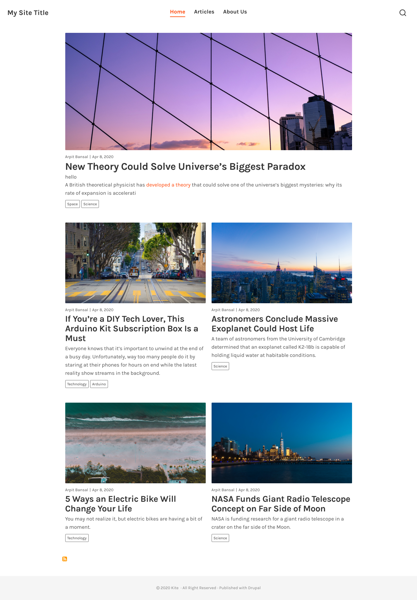

# Kite
Drupal 8 theme for blogging



## Development

For development, run the following commands from the theme root directory (with Node version `v10.15.0`).

```bash
$ npm install
$ gulp
```

The SCSS and JS files in `/src/` , which will be compiled to `/built/` automatically.
